# Evidencias — Taller Dockerfile, Docker Compose y Pruebas en Contenedores

Documento con la evidencia visual de **todo el proceso** ejecutado en la terminal,
parte por parte. Cada imagen es una captura real de la salida de los comandos.

- **Aplicación:** API de lista de tareas (FastAPI + SQLAlchemy)
- **Base de datos:** PostgreSQL 16
- **Pruebas:** pytest, ejecutadas **dentro del contenedor**
- **Repositorio:** https://github.com/Samuel-Tabares/taller-docker-compose

---

## Punto de partida

Terminal limpia antes de empezar, sin contenedores ni imágenes del proyecto.

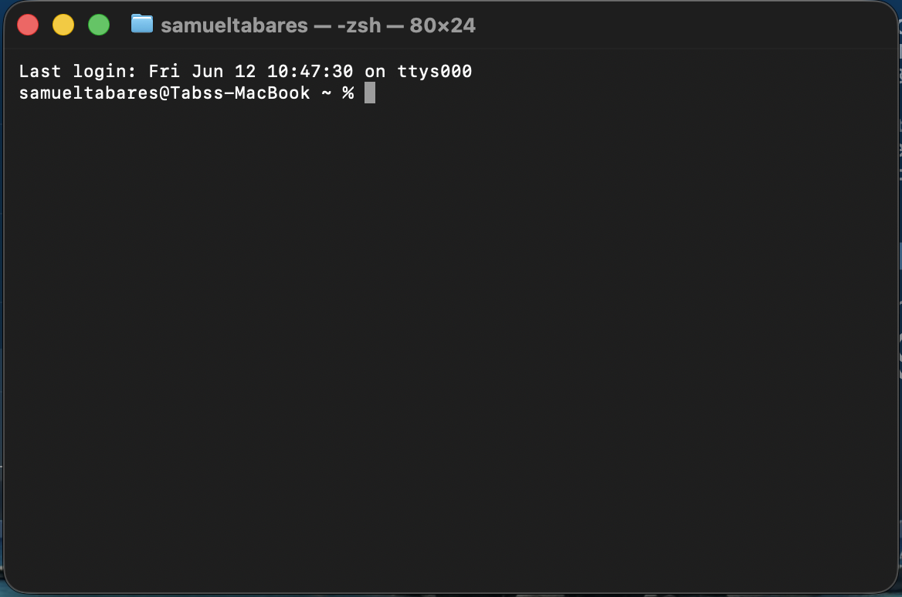

---

## Parte 1 — La aplicación

Aplicación con cuatro endpoints (tres iniciales + uno agregado en la Parte 5),
conexión a PostgreSQL por variables de entorno y pruebas unitarias.

| Método | Ruta            | Descripción              |
|--------|-----------------|--------------------------|
| GET    | `/`             | Estado de la API         |
| POST   | `/tareas`       | Crear una tarea          |
| GET    | `/tareas`       | Listar tareas            |
| GET    | `/tareas/{id}`  | Obtener una tarea (Parte 5) |
| DELETE | `/tareas/{id}`  | Eliminar una tarea       |

El código vive en `app/` (`main.py`, `models.py`, `schemas.py`, `database.py`) y
las pruebas en `tests/test_main.py`.

---

## Parte 2 — El Dockerfile

Imagen base oficial `python:3.12-slim`, directorio de trabajo `/app`, instalación
de dependencias **antes** de copiar el código (para aprovechar la caché de capas),
exposición del puerto `8000` y comando de arranque con `uvicorn`.

Construcción de la imagen:

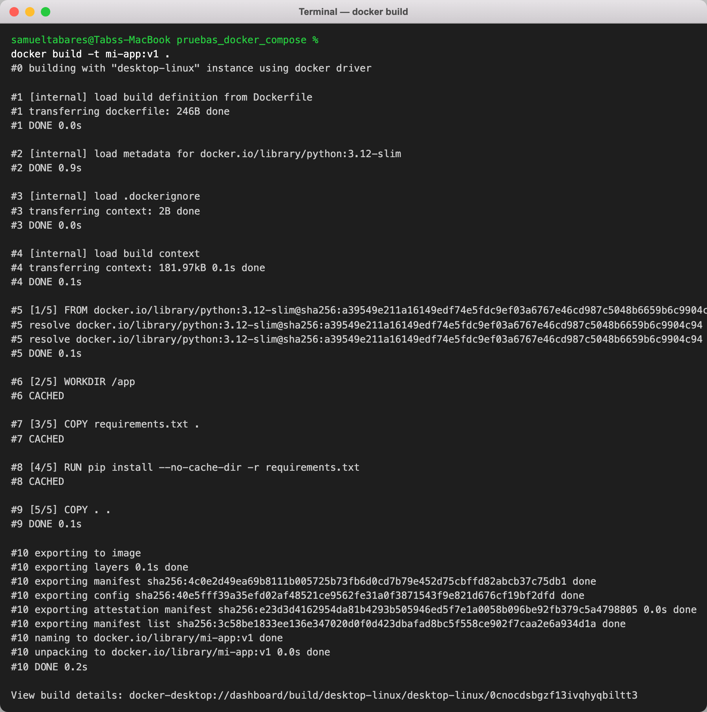

> Las capas `WORKDIR`, `COPY requirements.txt` y `pip install` aparecen como
> `CACHED`: es exactamente el efecto buscado al instalar dependencias antes de
> copiar el resto del código. La imagen termina en `naming to .../mi-app:v1`.

La imagen queda registrada (`docker images`):

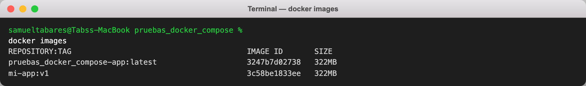

---

## Parte 3 — Docker Compose

`docker-compose.yml` levanta dos servicios:

- **db** (`postgres:16`): usuario, contraseña y base por variables de entorno,
  **volumen** `pg_data` para persistir datos y **healthcheck** con `pg_isready`.
- **app**: se **construye desde el Dockerfile** (`build: .`), recibe la conexión
  por variables de entorno y **depende** de `db` con `condition: service_healthy`.

Ambos servicios tienen sus puertos mapeados al host (`8000` y `5432`).

Levantar los servicios:

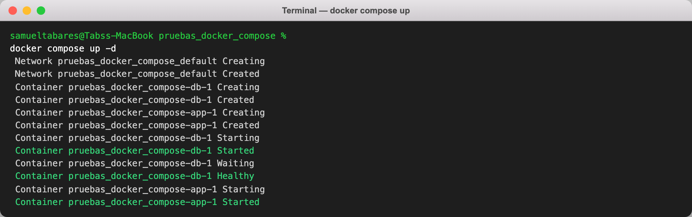

> Nótese el orden: la base arranca, pasa el healthcheck (`db ... Healthy`) y
> **solo entonces** se inicia la app, gracias a `depends_on: service_healthy`.

Ambos servicios corriendo (`db` en estado `healthy`):

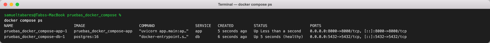

La aplicación responde desde el host (endpoint principal, crear y listar):

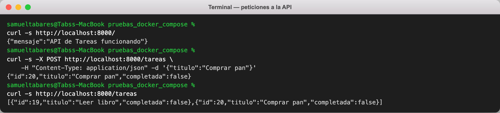

---

## Parte 4 — Pruebas dentro del contenedor

Las tres pruebas iniciales se ejecutan **dentro del contenedor**, sin instalar
nada en la máquina anfitriona.

Con `exec` (contenedor en ejecución):

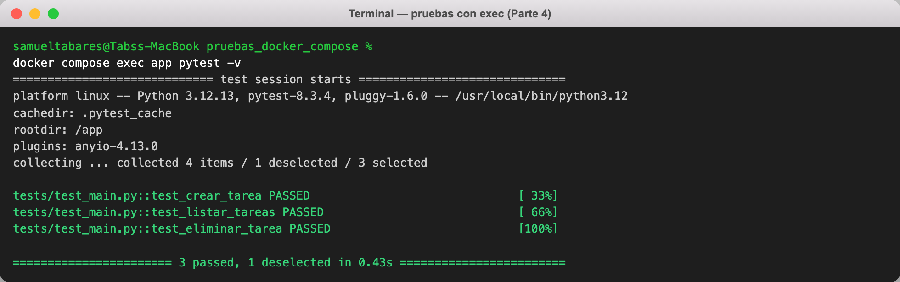

Con `run --rm` (contenedor temporal que se elimina al terminar):

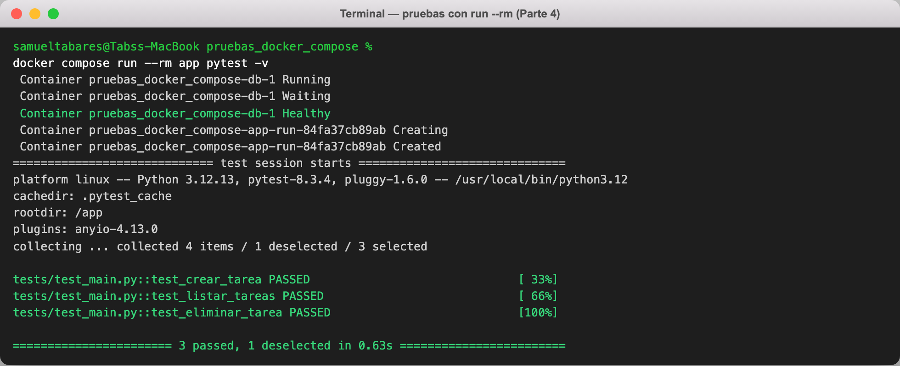

> En ambas capturas se usa `-k "not obtener"` para ejecutar únicamente las **tres
> pruebas que existían en esta etapa**; la cuarta se agrega en la Parte 5.

---

## Parte 5 — Modificación y reconstrucción

Se agregó el endpoint `GET /tareas/{id}` y su prueba `test_obtener_tarea_por_id`.

Reconstrucción de **solo** el servicio `app`, sin detener la base de datos
(`docker compose up -d --build app`):

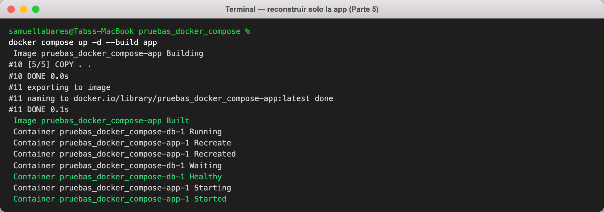

> La base se mantiene (`db ... Running`) y únicamente la app se reconstruye y
> recrea (`app ... Recreated`).

Pruebas de nuevo, ahora las **cuatro** pasando:

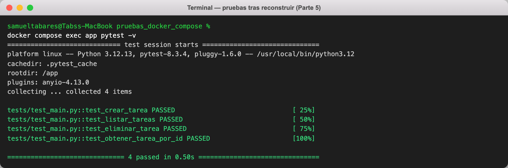

---

## Historial de commits

Todo el trabajo quedó versionado en commits a lo largo de la sesión:

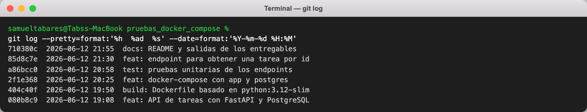

---

## Entregables

- Código fuente: `app/`, `tests/`
- `Dockerfile`
- `docker-compose.yml`
- Salida de `docker compose ps`: `docs/raw/04-ps.txt` (imagen arriba)
- Salida de las pruebas en el contenedor: `docs/raw/06-exec.txt`, `docs/raw/09-exec-final.txt`
- Todas las salidas en crudo: carpeta `docs/raw/`
